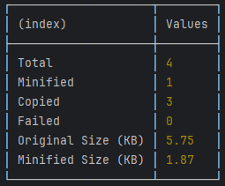

# Terser Minify Tool 🚀

<!-- repository summary badges start -->
<div>
    
    
    
    
    
    
    
    
    
    
    
    
    
    
    
    
    
    
    
</div>
<!-- repository summary badges end -->

<br/>

This script processes files within a project directory by minifying JavaScript files and copying other file types to a specified output directory. It leverages the Terser library for minification and tracks the size reduction achieved, reporting in kilobytes.

## Table of Contents
1. [Features](#features-)
2. [Prerequisites](#prerequisites-)
3. [Setup](#setup-)
4. [Running the Script](#running-the-script-)
5. [Output](#output-)
6. [Error Handling](#error-handling-)
7. [Contributing](#contributing-)
8. [License](#license-)
9. [Author](#author-)
10. [Contributors](#contributors-)
11. [Contact](#contact-)
12. [Acknowledgments](#acknowledgments-)

## Features 🌟

- **Minification of JavaScript Files**: Uses Terser to minify `.js` files, improving loading times and reducing bandwidth consumption.
- **File Copying**: Copies non-JavaScript files from the source directory to the output directory, preserving their original structure.
- **Size Tracking**: Reports the original and minified sizes of JavaScript files to help you understand the impact of minification.
- **Custom Configuration**: Allows specifying ignore patterns and other configurations through a `build.json` file.

## Prerequisites 📋

Before you run this script, ensure you have the following installed:
- [Node.js](https://nodejs.org/en/download/) (version 12 or higher is recommended)
- [Yarn](https://yarnpkg.com/) (version 1.22 or higher is recommended)

## Setup 🔧

1. **Clone the Repository**: Clone or download the repository to your local machine.
    ```bash
    git clone https://github.com/montasim/terser-minify-tool.git
    cd terser-minify-tool
    ```

2. **Install Dependencies**: Run the following command in the root directory of your project to install necessary dependencies.
    ```bash
    yarn install
    ```

3. **Configuration File**: Modify the `build.json` file in the root directory to set up your specific configurations.
    ```json
    {
      "parse": {
        "ecma": 8
      },
      "compress": {
        "ecma": 5,
        "warnings": false,
        "arrows": false,
        "collapse_vars": false,
        "comparisons": false,
        "computed_props": false,
        "hoist_funs": false,
        "hoist_props": false,
        "hoist_vars": false,
        "inline": false,
        "loops": false,
        "negate_iife": false,
        "properties": false,
        "reduce_funcs": false,
        "reduce_vars": false,
        "switches": false,
        "toplevel": false,
        "typeofs": false,
        "booleans": true,
        "if_return": true,
        "sequences": true,
        "unused": true,
        "conditionals": true,
        "dead_code": true,
        "evaluate": true
      },
      "mangle": {
        "safari10": true
      },
      "output": {
        "ecma": 5,
        "comments": false,
        "ascii_only": true
      }
    }
    ```

## Running the Script 🏃

To run the script, execute the following command in the root directory of your project:
```bash
yarn build
```

## Output 📊

The script outputs one table:

- Displays the total number of files processed:
   - how many were minified,
   - how many were copied,
   - how many failed,
   - the total original size,
   - minified sizes after processed.



## Error Handling 🛠️

If there are issues during file processing, errors will be logged to the console, specifying which files could not be processed and the nature of the error.

## Contributing 🤝

Contributions to this script are welcome. Please fork the repository and submit a pull request with your enhancements.

## License 📝

This script is provided under the MIT License. See the [LICENSE](LICENSE) file for more details.

## Author 📖

<table>
  <tr>
    <td align="center">
        
        <a href="https://github.com/montasim">
          <br>
            Ｍ♢ＮＴΛＳＩＭ
          </br>
        </a>
    </td>
  </tr>
</table>

## Contributors 👥

[](https://badges.pufler.dev)

## Contact 📬

If you have any suggestions or encounter issues, please open an [issue](https://github.com/montasim/terser-minify-tool/issues) on the [GitHub repository page](https://github.com/montasim/terser-minify-tool).

## Acknowledgments 🙏

1. [jrschumacher - terser script gist](https://gist.github.com/jrschumacher/943929c81e59a75b59f2eb849addcbf7)
